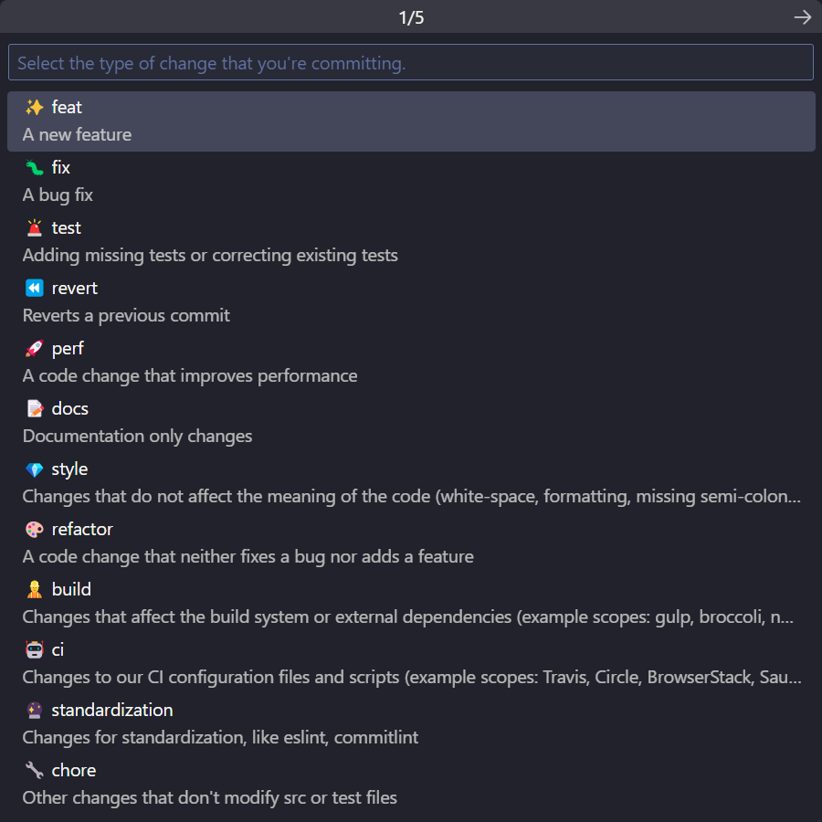

# VSCode Conventional Commits

> forked from
> [vivaxy/vscode-conventional-commits](https://github.com/vivaxy/vscode-conventional-commits)

# Feature

Better Scope

1. Support Nx

> https://github.com/conventional-changelog/commitlint/blob/master/%40commitlint/config-nx-scopes/readme.md

2. Optional Scope Classification

 

# Usage

在 nx 中使用：

```json
"conventionalCommits.useNxScopes": true
```

## build

```sh
yarn && yarn build
```

在 VSCode 中右键点击生成的插件，选择"install extension vsix"安装

# Dev

```sh
# install deps
yarn
```

press 'F5' to run extension.

## dev args config

```
# config dev folder

.vscode > launch.json > configuration.args

--folder-uri=/dev-project/
```

单独使用 vscode 窗口打开插件仓库运行。

## build

```sh
yarn build
```

在 vscode 生成插件后左侧直接右键点击最下面的"install extension vsix"安装
